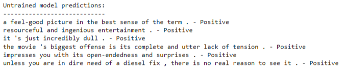
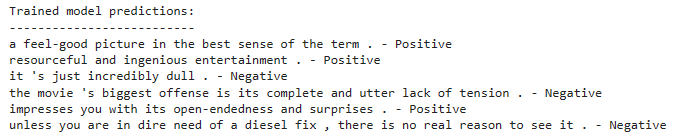

# Fine-tuning-an-LLM-using-LoRA

This repository is inspired by the article ["Fine-tuning Large Language Models (LLMs)"](https://towardsdatascience.com/fine-tuning-large-language-models-llms-23473d763b91) and contains code for training a text classification model using the Stanford Sentiment Treebank (SST-2) dataset and LoRA (Low-Rank Adaptation of Large Language Models) fine-tuning. LoRA is a way to make the language model more adaptable and efficient. Instead of training the whole model again for each task, LoRA freezes the pre-trained model and adds smaller trainable matrices to each model layer. These matrices help the model adapt to different tasks without changing all the parameters.

## Table of Contents
- [Installation](#installation)
- [Usage](#usage)
- [Model Architecture](#model-architecture)
- [Training](#training)
- [Inference](#inference)
- [References](#references)

## Installation

Before using the code in this repository, you need to install the required libraries. You can do this by running the following commands:

```bash
!pip install datasets
!pip install transformers
!pip install peft
!pip install evaluate
```

These commands will install the necessary Python libraries for working with datasets, transformers, LoRA, and evaluation metrics.

## Usage

Here's how to use the code in this repository:

1. **Load the SST-2 dataset**:

   The code loads the SST-2 dataset using the Hugging Face `datasets` library. SST-2 consists of sentences from movie reviews, annotated with sentiment labels. You can find more information about the SST-2 dataset [here](https://huggingface.co/datasets/glue/viewer/sst2).

2. **Define the LoRA model architecture**:

   The code uses the LoRA technique to fine-tune a pre-trained language model for text classification. LoRA efficiently adapts the model to the task by leveraging the low-rank property of weight differences. The implementation of LoRA can be found in the code.

3. **Tokenize the dataset**:

   The dataset is tokenized using the model's tokenizer, and special tokens like `[PAD]` are added if they don't already exist.

4. **Train the LoRA model**:

   The code defines training hyperparameters and trains the LoRA-adapted model using the provided dataset. Training arguments such as learning rate, batch size, and the number of epochs can be adjusted in the `training_args` variable.

5. **Infer with the trained LoRA model**:

   After training, you can use the trained LoRA-adapted model for inference on new text inputs. The code demonstrates how to load the model and make predictions on a list of example sentences.

## Model Architecture

The code uses a text classification model based on a pre-trained language model architecture. LoRA fine-tuning is applied to adapt this pre-trained model efficiently. The LoRA technique leverages the low-rank structure of weight differences to improve adaptation performance.

For detailed information about the LoRA technique, you can refer to the [LoRA paper](https://arxiv.org/abs/2106.09685).

## Training

To train the LoRA-adapted model, follow these steps:

1. Install the required libraries as mentioned in the [Installation](#installation) section.

2. Define your training dataset or use the provided SST-2 dataset.

3. Configure the model architecture and hyperparameters in the code.

4. Run the training code, and the model will be fine-tuned using the LoRA technique on your dataset.

## Inference

After training, you can use the trained LoRA-adapted model for inference on new text inputs. To do this:

1. Load the trained LoRA-adapted model as demonstrated in the code.

2. Tokenize your input text using the model's tokenizer.

3. Pass the tokenized input to the model for sentiment classification.

4. The model will predict whether the input text has a positive or negative sentiment.

## References

- [SST-2 Dataset](https://huggingface.co/datasets/glue/viewer/sst2)
- [LoRA Paper](https://arxiv.org/abs/2106.09685)

## Untrained Model Predictions




## Trained Model Predictions



